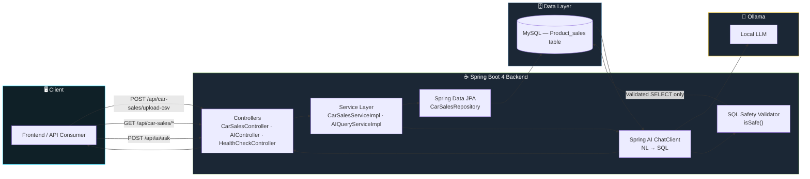
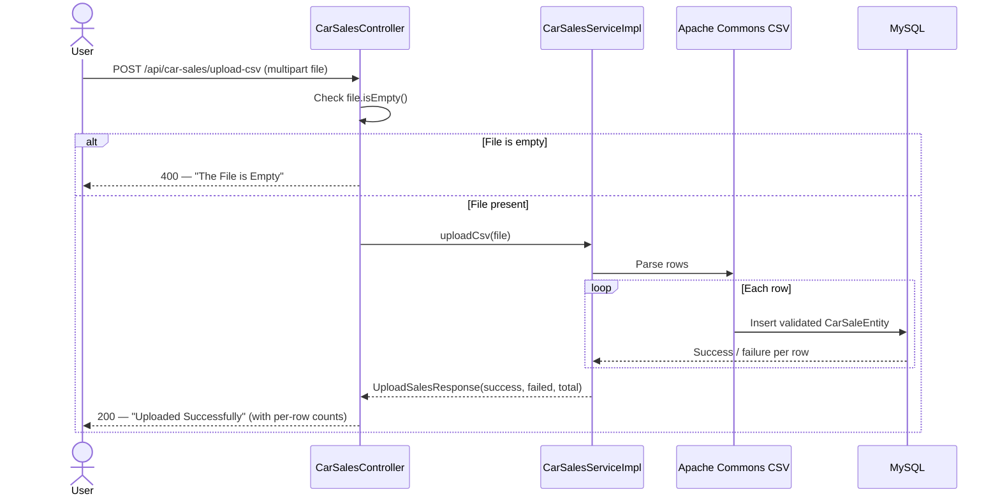
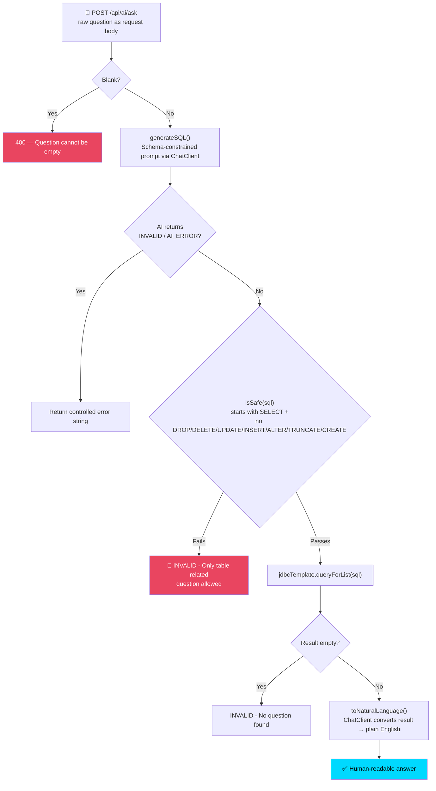
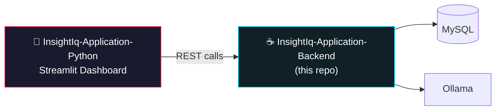

<div align="center">


<br/>


<br/>

[](https://github.com/bikashcode-dev/InsightIq-Application-Backend/stargazers)
[](https://github.com/bikashcode-dev/InsightIq-Application-Backend/forks)
[](https://github.com/bikashcode-dev/InsightIq-Application-Backend/commits)

</div>

**InsightIQ** is a Spring Boot REST API that turns raw car-sales CSV data into aggregated analytics and answers plain-English business questions — by generating and safely executing SQL through **Spring AI + Ollama**, live against MySQL.

> ⚡ Built on the brand-new **Spring Boot 4.1.0** — not a legacy 2.x/3.x stack.

---

## 📌 Table of Contents

- [Overview](#-overview)
- [Problem Statement](#-problem-statement)
- [Key Features](#-key-features)
- [System Architecture](#-system-architecture)
- [CSV Upload Flow](#-csv-upload-flow)
- [Natural Language → SQL Engine](#-natural-language--sql-engine)
- [SQL Safety Layer](#-sql-safety-layer)
- [Data Model](#-data-model)
- [API Reference](#-api-reference)
- [Tech Stack](#️-tech-stack)
- [Getting Started](#-getting-started)
- [Companion Frontend](#-companion-frontend)
- [Honest Project Status](#-honest-project-status)
- [Roadmap](#-roadmap)
- [Connect With Me](#-connect-with-me)

---

## 📖 Overview

Instead of manually digging through spreadsheets of car-sales records, a client uploads a **CSV file**, and InsightIQ:

1. Parses and stores every row in MySQL via a validated CSV pipeline
2. Serves ready-made aggregate analytics (yearly, monthly, brand, model, state, city, fuel-type, payment-mode, average price, total sales)
3. Lets a user **ask a question in plain English** — the backend generates SQL with an LLM, validates it's read-only, executes it, and turns the result back into a natural-language answer

> Built with **Spring Boot 4**, **Spring AI (Ollama starter)**, **Spring Data JPA**, **MySQL**, and **Apache Commons CSV**.

---

## 🎯 Problem Statement

Businesses sit on years of sales data, but turning that data into decisions usually needs SQL expertise and manual effort. Managers keep asking the same kinds of questions:

| Common Business Question |
|---|
| Which product sells the most? |
| Which products generate the highest profit? |
| Which categories are trending? |
| What caused revenue to decrease? |
| Which inventory should be restocked? |

Traditional dashboards only draw charts — **they don't explain the business.**

> 💡 InsightIQ answers these questions directly, in the same words a manager would ask them.

---

## ✨ Key Features

<table>
<tr>
<td width="50%" valign="top">

### 📂 CSV Ingestion Pipeline
- `multipart/form-data` upload via `POST /api/car-sales/upload-csv`
- Row-level parsing with **Apache Commons CSV**
- Per-row success/failure counts returned, not an all-or-nothing failure
- Unique constraint on `car_number` prevents duplicate records

</td>
<td width="50%" valign="top">

### 🤖 AI Business Chat Assistant
- `POST /api/ai/ask` — ask questions in **plain English**
- No SQL knowledge required
- Answers generated in natural language, not raw JSON

</td>
</tr>
<tr>
<td width="50%" valign="top">

### 🧠 Natural Language → SQL Engine
- Powered by **Spring AI `ChatClient` + Ollama**
- Schema-constrained prompt (only `Product_sales` columns allowed)
- Out-of-scope questions return `INVALID` instead of guessing

</td>
<td width="50%" valign="top">

### 📊 11 Aggregate Analytics Endpoints
- Yearly / monthly / total sales
- Brand / model / fuel-type / payment-mode / state / city breakdowns
- Average price
- Every response wrapped in a consistent `ApiResponse<T>` envelope

</td>
</tr>
</table>

**Example questions you can ask InsightIQ:**

```
💬 "Which brand sold the most cars?"
💬 "What is the average price of cars sold in Maharashtra?"
💬 "How many CNG cars were sold in 2024?"
💬 "Which state has the highest total sales?"
```

---

## 🏗 System Architecture



---

## 📤 CSV Upload Flow



---

## 🧠 Natural Language → SQL Engine



---

## 🛡 SQL Safety Layer

Two layers of protection before any AI-generated SQL touches the database:

**1. Prompt-level constraint** — the LLM is told the query must target only the `Product_sales` table and its known columns, and must return `INVALID` for anything unrelated (including "current stock" questions, since the table only holds *sold* cars).

**2. Code-level validation (`isSafe()`)** — regardless of what the LLM returns, the query is rejected unless it starts with `SELECT` and contains none of:

| 🚫 Blocked Keywords |
|---|
| `DROP` |
| `DELETE` |
| `UPDATE` |
| `INSERT` |
| `ALTER` |
| `TRUNCATE` |
| `CREATE` |

> Defense in depth: even a compromised or hallucinating prompt can't reach a mutating query — the check happens in Java, not just in the prompt.

---

## 🗂 Data Model

The `Product_sales` MySQL table (mapped by `CarSaleEntity`) backs every endpoint:

| Column | Type | Notes |
|---|---|---|
| `id` | `BIGINT` | Auto-generated identity |
| `car_number` | `VARCHAR` | **Unique**, not null |
| `car_brand` / `car_model` / `car_color` | `VARCHAR` | Vehicle identity |
| `year` | `INT` | Manufacture/sale year |
| `time_of_purchase` / `date_of_purchase` | `TIME` / `DATE` | Transaction timestamp |
| `price` | `BIGINT` | Sale price |
| `mileage` | `DOUBLE` | |
| `engine` | `INT` | Engine capacity |
| `fuel_type` | `VARCHAR` | Petrol / Diesel / CNG / EV etc. |
| `payment_mode` | `VARCHAR` | Cash / Credit Card / etc. |
| `state` / `city` | `VARCHAR` | Location of sale |
| `customer_name` / `contact_number` | `VARCHAR` | Buyer info |
| `warranty_period` | — | Warranty terms |

> This is exactly the schema the AI's SQL-generation prompt is constrained to — nothing more, nothing less.

---

## 📡 API Reference

Base path: **`/api`**

<details open>
<summary><b>🩺 Health</b></summary>

| Method | Endpoint | Response |
|---|---|---|
| `GET` | `/Health/ok` | Plain text health status |
| `GET` | `/Health/api/check` | Plain text health status |

</details>

<details open>
<summary><b>📂 Car Sales — Ingestion</b></summary>

| Method | Endpoint | Body | Response |
|---|---|---|---|
| `POST` | `/api/car-sales/upload-csv` | `multipart/form-data` — field `file` | `{ successCount, failedCount, totalCount }` |

</details>

<details open>
<summary><b>📊 Car Sales — Analytics</b></summary>

| Method | Endpoint | Params | Returns |
|---|---|---|---|
| `GET` | `/api/car-sales/yearly-count` | — | Sales grouped by year |
| `GET` | `/api/car-sales/monthly-sales` | `?year=` | Sales grouped by month for a given year |
| `GET` | `/api/car-sales/state-count` | — | Sales grouped by state |
| `GET` | `/api/car-sales/city-count` | — | Sales grouped by city |
| `GET` | `/api/car-sales/brand-count` | — | Sales grouped by brand |
| `GET` | `/api/car-sales/model-count` | — | Sales grouped by model |
| `GET` | `/api/car-sales/fuel-type-count` | — | Sales grouped by fuel type |
| `GET` | `/api/car-sales/payment-mode-count` | — | Sales grouped by payment mode |
| `GET` | `/api/car-sales/average-price` | — | Average sale price |
| `GET` | `/api/car-sales/total-sales` | — | Total sales count |

</details>

<details open>
<summary><b>🤖 AI</b></summary>

| Method | Endpoint | Body | Returns |
|---|---|---|---|
| `POST` | `/api/ai/ask` | Raw text question | Natural-language answer |

</details>

Every analytics response is wrapped in a consistent envelope:

```json
{
  "success": true,
  "message": "Data Read Successfully",
  "data": [ /* ... */ ],
  "statusCode": 200
}
```

---

## ⚙️ Tech Stack

<div align="center">

**Backend**


**Database & AI**


**Data Ingestion**


</div>

---

## 🚀 Getting Started

```bash
# 1. Clone the repo
git clone https://github.com/bikashcode-dev/InsightIq-Application-Backend.git
cd InsightIq-Application-Backend

# 2. Configure local settings
# Create src/main/resources/application.yaml (gitignored — not committed)
# with your MySQL connection and Ollama base URL/model

# 3. Run
./mvnw spring-boot:run
```

**Prerequisites:**
- Java 17
- MySQL running with an accessible schema
- [Ollama](https://ollama.com) running locally with a chat-capable model pulled

> `application.yaml` is intentionally excluded via `.gitignore` — configure your own local DB credentials and Ollama settings; nothing sensitive is committed to the repo.

---

## 🧪 Testing

```bash
./mvnw test
```

| Metric | Current |
|---|---|
| Test files | 1 (`InsightIqApplicationTests`) |
| Coverage | Application-context smoke test only |
| CI/CD pipeline | Not yet configured |

> Being upfront here on purpose: this is the honest current state, not an inflated claim. Expanding coverage for `CarSalesServiceImpl` (CSV parsing) and `AIQueryServiceImpl` (`isSafe()` in particular, since it's the security boundary) is the single highest-value next step — tracked in the Roadmap.

---

## 🔗 Companion Frontend

This backend is consumed by a separate **Streamlit analytics frontend**:
[InsightIq-Application-Python](https://github.com/bikashcode-dev/InsightIq-Application-Python) — turns these REST responses into interactive dashboards, KPIs, and an AI chat UI.



---

## 🔍 Honest Project Status

| Claimed Elsewhere | Actual Code Status |
|---|---|
| Spring Boot 3.x | ✅ Actually **Spring Boot 4.1.0** — newer than claimed |
| Java 21 | ⚠️ `pom.xml` sets `java.version` to **17** |
| Spring Security Authentication | ⚠️ Not yet in `pom.xml` — API is fully open today, tracked in Roadmap |
| MIT License | ⚠️ No `LICENSE` file currently in the repo — add one to make reuse terms explicit |
| Data visualization | ✅ Handled by the separate Python frontend, not this backend |
| Role-Based Access Control | ⚠️ Not yet implemented |
| Automated test suite | ⚠️ Only a single Spring context smoke test exists today |

> This section exists on purpose — a README that only lists aspirations isn't useful to a recruiter reading the actual code. What's built is built; what isn't is on the roadmap below.

---

## 🚀 Roadmap

**Housekeeping (quick wins)**
- [ ] Add a `LICENSE` file (repo currently has none)
- [ ] Add a GitHub Actions CI workflow (`mvn test` on every push)
- [ ] Expand unit tests for `CarSalesServiceImpl` and `AIQueryServiceImpl.isSafe()`

**Product features**
- [ ] Spring Security + JWT-protected endpoints
- [ ] Role-Based Access Control
- [ ] Excel (.xlsx) upload support
- [ ] PDF / Excel report export
- [ ] Predictive sales forecasting
- [ ] Docker Compose (backend + MySQL + Ollama in one command)
- [ ] Cloud deployment guide (AWS / Azure / GCP)
- [ ] Pagination for large aggregate responses

---

<div align="center">

## 🤝 Connect With Me

**Bikash Sah**
Java Full-Stack Developer · Spring Boot · Spring AI · Business Intelligence · Data Analytics

[](https://www.linkedin.com/in/bikash-sah-java)
[](mailto:bikashcod@gmail.com)
[](https://github.com/bikashcode-dev)


</div>
