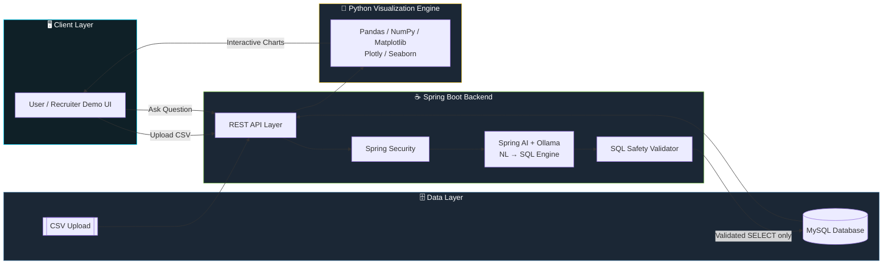
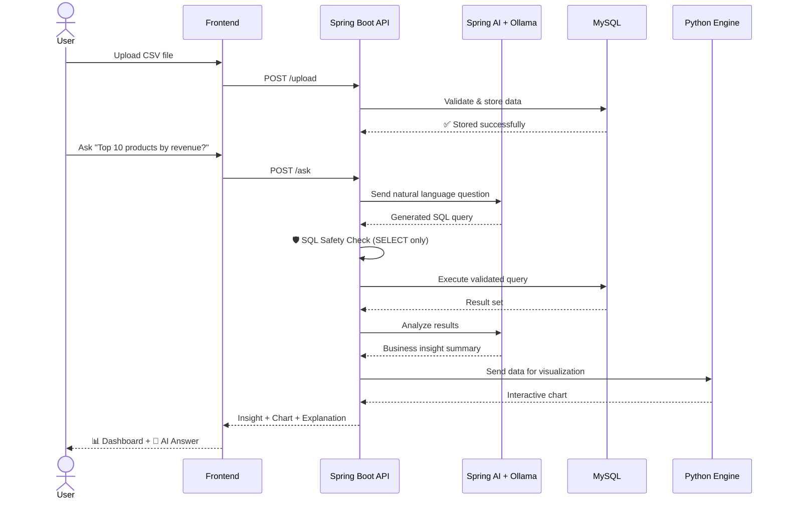
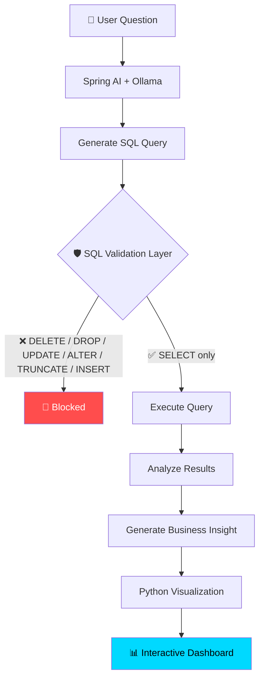

<div align="center">


<br/>


<br/>

[](https://github.com/bikashcode-dev/InsightIq-Application-Backend/stargazers)
[](https://github.com/bikashcode-dev/InsightIq-Application-Backend/forks)
[](https://github.com/bikashcode-dev/InsightIq-Application-Backend/commits)

</div>

---

## 📌 Table of Contents

- [Overview](#-overview)
- [Problem Statement](#-problem-statement)
- [Live Demo Preview](#-live-demo-preview)
- [Key Features](#-key-features)
- [System Architecture](#-system-architecture)
- [How It Works — Request Flow](#-how-it-works--request-flow)
- [Natural Language → SQL Engine](#-natural-language--sql-engine)
- [SQL Safety Layer](#-sql-safety-layer)
- [AI Sales Intelligence](#-ai-sales-intelligence)
- [Tech Stack](#️-tech-stack)
- [Example Use Case](#-example-use-case)
- [Security](#-security)
- [Roadmap](#-roadmap)
- [Target Users](#-target-users)
- [Why InsightIQ?](#-why-insightiq)
- [Connect With Me](#-connect-with-me)

---

## 📖 Overview

**InsightIQ** is an AI-powered Business Intelligence and Sales Analytics platform that turns massive, messy sales spreadsheets into clear, actionable insights — automatically.

Instead of manually digging through thousands (or millions) of rows, a user simply **uploads a CSV**, and InsightIQ takes over: validating the data, analyzing it, generating business insights, building interactive dashboards, and answering plain-English questions using AI.

> Built with **Spring Boot**, **Spring AI**, **Ollama**, **MySQL**, and **Python** — a complete end-to-end AI analytics pipeline.

---

## 🎯 Problem Statement

Businesses sit on years of sales data, but turning that data into decisions usually needs SQL expertise and manual effort. Managers keep asking the same kinds of questions:

| ❓ Common Business Question |
|---|
| Which product sells the most? |
| Which products generate the highest profit? |
| Which products are underperforming? |
| Which categories are trending? |
| What caused revenue to decrease? |
| Which inventory should be restocked? |
| Which products should be discontinued? |

Traditional dashboards only draw charts — **they don't explain the business.**

> 💡 **InsightIQ acts like an experienced Sales Manager and Business Analyst** — helping decision-makers *understand* their data instead of just staring at it.

---

## 🎥 Live Demo Preview

<div align="center">

<!--
  📸 RECRUITER TIP: Replace the line below with a real screen-recording GIF or screenshot.
  Record your dashboard with ScreenToGif / Peek, save as demo.gif inside a `docs/` or `assets/` folder,
  then point the path below at it — this is the single biggest upgrade you can make to this README.
-->


<sub>⬆️ Replace this with a GIF of: CSV upload → AI chat question → generated SQL → dashboard appearing</sub>

</div>

---

## ✨ Key Features

<table>
<tr>
<td width="50%" valign="top">

### 📂 Massive CSV Data Processing
- Upload datasets with thousands → millions of records
- Fast ingestion, validation & parsing
- Works across multiple business domains

</td>
<td width="50%" valign="top">

### 🤖 AI Business Chat Assistant
- Ask questions in **plain English**
- No SQL knowledge required
- AI explains results in business language

</td>
</tr>
<tr>
<td width="50%" valign="top">

### 🧠 Natural Language → SQL Engine
- Converts questions into optimized SQL
- Powered by **Spring AI + Ollama**
- Built-in safety validation layer

</td>
<td width="50%" valign="top">

### 📈 Interactive Analytics Dashboard
- Auto-generated charts via Python
- Trends, rankings, comparisons, heatmaps
- Bar / Line / Pie visualizations

</td>
</tr>
</table>

**Example questions you can ask InsightIQ:**

```
💬 "Which product sold the most this month?"
💬 "Show the top 10 products by revenue."
💬 "Which products are causing losses?"
💬 "Compare this month's sales with last month."
💬 "Which category should receive more investment?"
```

---

## 🏗 System Architecture



---

## 🔄 How It Works — Request Flow



---

## 🧠 Natural Language → SQL Engine



---

## 🛡 SQL Safety Layer

Only **read-only** operations are ever allowed to touch the database.

| ✅ Allowed | 🚫 Blocked |
|---|---|
| `SELECT` | `DELETE` |
| | `DROP` |
| | `UPDATE` |
| | `ALTER` |
| | `TRUNCATE` |
| | `INSERT` |

---

## 📊 AI Sales Intelligence

InsightIQ automatically surfaces:

`Highest Selling Products` · `Lowest Selling Products` · `Trending Products` · `Declining Products` · `Highest Revenue Products` · `Highest Profit Products` · `Loss-Making Products` · `Best/Worst Performing Categories` · `Monthly & Yearly Growth` · `Revenue & Profit Trends` · `Inventory Performance` · `Regional Sales Performance` · `Customer Purchase Trends` · `Business Opportunities` · `Actionable Recommendations`

**Visualization types generated:** Sales Trends · Revenue Charts · Profit/Loss Analysis · Monthly & Yearly Comparisons · Product Ranking · Category Performance · Revenue Distribution · Region-wise Sales · Heatmaps · Pie / Line / Bar Charts

---

## ⚙️ Tech Stack

<div align="center">

**Backend**


**Database & AI**


**Data Visualization**


</div>

---

## 🚗 Example Use Case

> Imagine a **car dealership** with over **2 million sales records**.

1. Upload the CSV file
2. Ask InsightIQ:
   - *"Which car model generated the highest revenue?"*
   - *"Which SUV is selling the fastest?"*
   - *"Which sedan has declining demand?"*
   - *"Which brand generates the highest profit?"*
   - *"Which inventory should be restocked?"*
3. Get AI-generated recommendations **with interactive charts** — instantly.

**Supported domains:** Car Showrooms · Shopping Malls · Retail Stores · Electronics · Fashion · Grocery · Medical Stores · Restaurants · Manufacturing · FMCG · E-commerce · Wholesale · Any product-based business

---

## 🔐 Security

- ✅ Spring Security Authentication
- ✅ Secure REST APIs
- ✅ Role-Based Access Control
- ✅ SQL Validation Layer (SELECT-only execution)
- ✅ Protected Dashboard Access

---

## 🚀 Roadmap

- [ ] Excel File Support
- [ ] JSON Import
- [ ] PDF Report Generation
- [ ] Excel Export
- [ ] AI Report Generator
- [ ] Predictive Sales Forecasting
- [ ] Customer Segmentation
- [ ] Inventory Forecasting
- [ ] Scheduled Email Reports
- [ ] Voice-Based AI Queries
- [ ] Multi-Tenant Architecture
- [ ] Docker Deployment
- [ ] Kubernetes Support
- [ ] Cloud Deployment (AWS / Azure / GCP)
- [ ] Real-Time Streaming Analytics

---

## 💼 Target Users

`Sales Managers` · `Business Owners` · `Retail Companies` · `Store Managers` · `Data Analysts` · `Business Analysts` · `Decision Makers` · `Operations Teams`

---

## 🌟 Why InsightIQ?

| Traditional Dashboards | 🚀 InsightIQ |
|---|---|
| Shows charts only | Shows charts **+ explains what they mean** |
| Requires SQL knowledge | Ask questions in **plain English** |
| Static reports | **AI-generated**, dynamic insights |
| Manual analysis | **Automated** Sales Manager-style analysis |
| Generic metrics | Actionable, business-specific recommendations |

---

<div align="center">

## 🤝 Connect With Me

**Bikash Sah**
Java Full-Stack Developer · Spring Boot · Spring AI · Business Intelligence · Data Analytics

[](https://www.linkedin.com/in/bikash-sah-java)
[](mailto:bikashcod@gmail.com)
[](https://github.com/bikashcode-dev)


</div>
